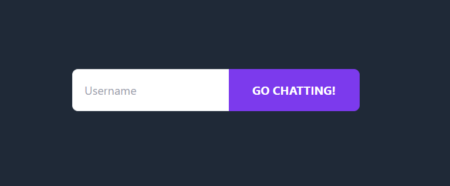
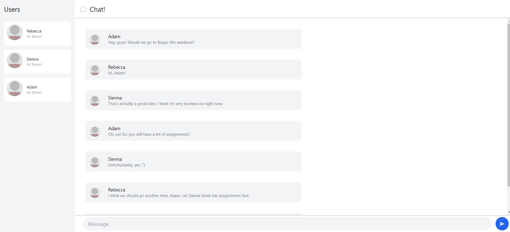
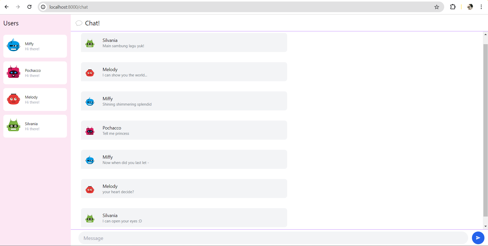

## Tutorial 3: WebChat using yew
### 3.1. Original code
Setelah meng-clone kedua repository, kita bisa menjalankan kode WebsocketServer dan YewChat menggunakan perintah `npm start`. Kita bisa berinteraksi menggunakan Webchat yang dijalankan pada port `8000` seperti contoh di bawah
 
1. Memasukkan username yang akan digunakan untuk berinteraksi
 

 

 
2. Membuka beberapa tab untuk mensimulasikan banyak user yang saling berkirim pesan
 

### 3.2. Add some creativities to the webclient

 
Modifikasi yang saya lakukan:
1. Menambahkan avatar untuk foto profil user dengan mengganti url `dicebear` yang tidak valid
2. Mengganti warna latar belakang pada bagian daftar user menjadi pink
3. Mengganti warna border menjadi ungu pada bagian chat
 
Semua perubahan tersebut dilakukan di `src/components/chat.rs`